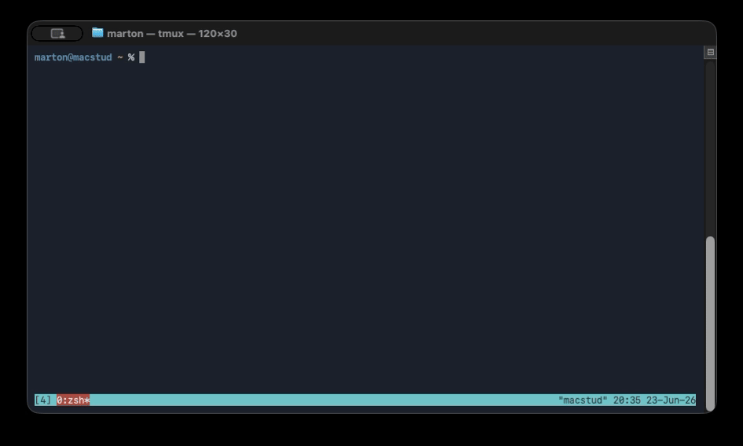

# yo — a natural-language command assistant for your shell



Type `yo <find files over 1gb>` at your prompt. The request goes to an LLM, and the
command it suggests is **prefilled onto your next prompt line**: ready to run,
edit, or cancel. Ask a question instead and you get a printed answer. No command
runs until you press Enter.

`yo` is an acknowledged **GPLv3 derivative work** of
[yoshell (`pizlonator/yosh`)](https://github.com/pizlonator/yosh): it reuses
yoshell's system-prompt design and tool/response protocol. It is a standalone Go
binary plus a small shell-integration snippet. See
[License & provenance](#license--provenance).

---

## Status

- **Works today:** Windows PowerShell **7+** (recommended) and **5.1**, plus
  macOS **zsh**. Providers: **Anthropic** (default), **OpenAI**, **Grok** (xAI), and **Gemini** (Google).
- **Release builds:** Windows zips are Authenticode-signed. macOS zips are
  Developer ID-signed and notarized by Apple.
- **Planned:** Linux builds and bash integration; `winget` package submission; brew tap for macOS.

---

## Install

You need the `yo` binary on your machine, the integration line in your shell
profile, and an API key. Use the platform guide for install/build details:

- [Windows PowerShell](docs/WINDOWS.md)
- [macOS zsh](docs/MACOS.md)

Release assets:

| Platform | Asset |
|----------|-------|
| Windows x64 | [`yo-windows-amd64.zip`](https://github.com/martona/yo/releases/latest/download/yo-windows-amd64.zip) |
| Windows Arm64 | [`yo-windows-arm64.zip`](https://github.com/martona/yo/releases/latest/download/yo-windows-arm64.zip) |
| macOS Apple Silicon | [`yo-macos-arm64.zip`](https://github.com/martona/yo/releases/latest/download/yo-macos-arm64.zip) |
| macOS Intel | [`yo-macos-amd64.zip`](https://github.com/martona/yo/releases/latest/download/yo-macos-amd64.zip) |

Each zip contains the `yo` binary plus license/provenance files. Release assets
also include [`SHA256SUMS.txt`](https://github.com/martona/yo/releases/latest/download/SHA256SUMS.txt)
and [`yo.cdx.json`](https://github.com/martona/yo/releases/latest/download/yo.cdx.json).

Every release zip is attested by GitHub's build-provenance flow:

```sh
gh attestation verify yo-macos-arm64.zip --repo martona/yo
# or: gh attestation verify yo-windows-amd64.zip --repo martona/yo
```

You can also compare each asset with `SHA256SUMS.txt`.

Release workflow details and signing inputs are in
[docs/RELEASING.md](docs/RELEASING.md).

---

## Usage

Just type `yo` followed by what you want, in plain language:

```powershell
yo list every pdf modified this week
yo which processes are using the most memory
yo set my git user.email to me@example.com
```

```sh
yo list every pdf modified this week
yo show disk usage for this directory
yo set my git user.email to me@example.com
```

A **command** is prefilled on your next prompt with a one-line explanation above it.
Press Enter to run, edit it first, or press Ctrl-C / clear the line to cancel.
A **question with no obvious command** is answered inline instead.

### Multi-step, and "run a diagnostic then tell me the answer"

`yo` favors a simple, reusable command over a clever one-liner. When answering needs
more than one step — or needs to *see a command's output first* — it issues one step,
waits for you to run it, reads the result, and continues or answers:

```powershell
yo is the print spooler running, and start it if it's stopped
#  -> Get-Service Spooler         (you run it)
#  -> if it's stopped: Start-Service Spooler   (you run it)
#  -> "Done — the Spooler service is now running."
```

Each step is prefilled and waits for you; nothing auto-chains.

### "Why did that fail?"

If recent output is on your screen, `yo` can use it as context:

```powershell
go buid ./cmd/yo        # oops, typo -> error on screen
yo why did that fail
#  -> "You typed `buid` instead of `build`. Try: go build ./cmd/yo"
```

Screen context comes from the Windows console buffer automatically, or from
**zellij** / **tmux** if you run inside either. Outbound screen text is
**secret-scrubbed** before it leaves your machine (see
[Safety & privacy](#safety--privacy)). Context is immensely useful, but under
Windows Terminal we're limited to the viewport, not actual scrollback data. A
multiplexer gives yo deeper resolved screen history when one is available.

### Questions with shell metacharacters

Because `yo` hooks the Enter key (via PSReadLine on PowerShell and ZLE on zsh),
you can ask questions containing `( ) < > & ; | $` without quoting them yourself:

```sh
yo what does (ps -ef | grep ssh) actually return?
```

The line is captured and safely quoted before the shell parses it.

---

## Configuration

All settings live in `~/.yoconf` (`%USERPROFILE%\.yoconf` on Windows), re-read on
every call. Every directive is optional; see [`yoconf.example`](yoconf.example).

| Directive  | Default            | Meaning |
|------------|--------------------|---------|
| `provider` | inferred from key  | `anthropic` or `openai`. If omitted, inferred from whichever key env var is set. |
| `model`    | per provider       | `claude-opus-4-8` (anthropic) / `gpt-5.5` (openai). |
| `key`      | from env var       | API key override. The env var is the preferred path. |
| `base_url` | provider default   | Proxy or OpenAI-compatible endpoint. |
| `memory`   | `on`               | Cross-call session memory (`memory false` disables). |
| `debug`    | `off`              | Trace each LLM call's scaffolding to stderr (see below). |
| `prefill_space` | `off`         | Prefix prefilled commands with a leading space, so history tools that ignore space-prefixed lines (e.g. Atuin) skip them. |

**Environment variables:** `ANTHROPIC_API_KEY` / `OPENAI_API_KEY` supply the key (and
pick the provider when none is configured). `YO_DEBUG` overrides the `debug` directive
for one session.

**Debug tracing** prints a one-line trace per call to **stderr**: provider/model, your query, the *sizes* of any attached context, and the response type + `pending` flag:

```
yo[debug] -> anthropic/claude-opus-4-8  q="is my usb mounted"  [scrollback +537ch, memory +2744ch]
yo[debug] <- command pending=true  "Get-CimInstance Win32_DiskDrive ..."
```

---

## Safety & privacy

- **Nothing runs until you press Enter.** `yo` only *prefills*; you review and decide. The tool assumes an adult at the keyboard.
- **No telemetry.** `yo` makes exactly one kind of network call: to the LLM API you
  configure (Anthropic, OpenAI, Grok, Gemini, or your `base_url`). Nothing else phones home; there
  is no analytics of any kind.
- **Secrets are redacted** from any screen output before it is sent, using
  [gitleaks'](https://github.com/gitleaks/gitleaks) detection engine (embedded; nothing
  extra to install). It fails closed — if the detector can't initialize, the screen
  context is dropped rather than sent raw.
- **Session memory is local.** Recent exchanges are kept in a per-session file under
  your OS temp directory (no command *output*), used only to resolve follow-ups like
  "delete the top one." Disable with `memory false`.

---

## How it works

`yo` is a native Go binary; the per-shell snippet (`yo --init powershell` or
`yo --init zsh`) is the only shell-specific part. The binary assembles the
request (your text + optional screen context + session memory), calls the
provider with **forced tool use** so the model must return a typed `command` or
`chat` — never prose to descrape — and prints a shell-readable result. The
snippet prefills the command or prints the answer. Multi-step continuation rides
`YO_STATE`; the binary itself stays stateless. Full design rationale:
[docs/DESIGN-NOTES.md](docs/DESIGN-NOTES.md).

## Command-line reference

| Command | Purpose |
|---------|---------|
| `yo <text>`            | Natural-language request → prefilled command or chat answer. |
| `yo --setup`           | Guided, confirm-each-step installer (profile, shell checks, key). |
| `yo --uninstall`       | Remove the integration from your shell profile. |
| `yo --init powershell` | Print the integration snippet (for your `$PROFILE`). |
| `yo --init zsh`        | Print the integration snippet (for your `~/.zshrc`). |
| `yo --check`           | Validate config + key (no network). |
| `yo --config`          | Show the resolved configuration. |
| `yo --dry-run "<q>"`   | Print the assembled API request (no key/network). |
| `yo --version` / `--help` | Version / help. |

Exit codes: `0` success, `1` runtime error, `2` usage error.

## License & provenance

`yo` is licensed under the **GNU General Public License v3** ([LICENSE](LICENSE)) — the
same license as yoshell, Bash, and Readline.

It is an acknowledged **derivative work** of
[yoshell (`pizlonator/yosh`)](https://github.com/pizlonator/yosh): it reuses yoshell's
LLM system-prompt design and its tool/response (function-calling) contract and
multi-step protocol, re-expressed as a standalone tool. It does not copy or fork
yoshell's Bash/Readline C. The full derivative-work statement, the list of significant
changes, and bundled third-party notices (e.g. gitleaks, MIT) are in
[NOTICE](NOTICE).

This is a personal, non-commercial project.
